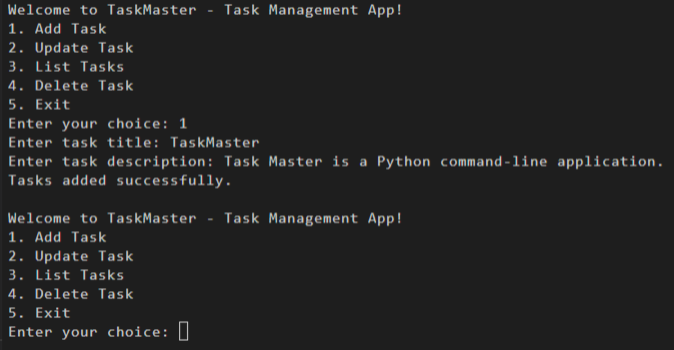

# Task Master

Task Master is a Python command-line application designed to help users organize and manage their tasks efficiently. It provides a user-friendly interface where users can add, update, list, and delete tasks. The application utilizes basic data structures such as lists and dictionaries to store task information and incorporates file I/O operations for persistent data storage.

## Table of Contents

- [Task Master](#task-master)
  - [Project Overview](#project-overview)
  - [Main Technologies](#main-technologies)
  - [Features](#features)
    - [App Overview](#app-overview)
    - [Screenshots](#screenshots)
    - [Planned Features](#planned-features)
    - [How to Use](#how-to-use)    
  - [Core Logic for Managing Tasks](#core-logic-for-managing-tasks)
  - [Documentation](#documentation)
  - [Testing](#testing)
  - [Bugs](#bugs)
  - [Validator Testing](#validator-testing)
  - [Bugs](#bugs)
  - [Validator Testing](#validator-testing)
  - [Deployment](#deployment)
  - [Credits](#credits)

## Project Overview

Task Master is developed to provide users with a simple yet effective tool for managing their tasks. The project aims to enhance productivity and organization by offering essential task management functionalities through a command-line interface.

## Main Technologies

Task Master primarily utilizes core Python functionalities for its implementation.

### Features

### App Overview

Task Master presents a menu-driven interface with options for adding, updating, listing, and deleting tasks. Users interact with the application through intuitive commands, making task management seamless and efficient.

### Screenshots

**Figure 1: Task Management Application - Main Menu**

**Figure 2: Task Management Application - Menu-Driven Interface Flowchart**

**Figure 3: Task Management Application - Add Task**

### Planned Features

1. **Task Tracking and Reminder:** Enhance task management by allowing users to track the progress of tasks, set deadlines, and receive reminders or notifications for upcoming deadlines or overdue tasks.

2. **Task Filtering and Sorting:** Provide options for users to filter and sort tasks based on criteria such as priority, due date, and status. 

3. **User Authentication and Authorization:** Implement user accounts with authentication and authorization mechanisms to ensure data privacy and security. Users can sign up, log in, and manage their accounts securely.

## How to Use

To use Task Master, follow these steps:

1. Select the desired option from the menu to perform specific tasks, such as adding, updating, listing, or deleting tasks.
2. Input the required information as prompted by the application.
3. Follow the on-screen instructions to navigate through the various functionalities of Task Master.

## Core Logic for Managing Tasks

The core logic for managing tasks is implemented within the Python script. This includes functions for adding tasks, updating task status, listing tasks, and deleting tasks. Basic data structures such as lists and dictionaries are used to store task information. 

## Documentation

The codebase is documented with comments to explain the purpose and functionality of each function or section. 

## Future Features

- **Task Creation and Organization:** Allow users to create tasks with details such as title, description, due date, priority level, and status. 

- **Collaboration and Sharing:** Support collaboration features such as task assignment, sharing projects or tasks with team members, and commenting on tasks. 

- **Data Export and Import:** Allow users to export task data to common file formats. 

## Testing

I have manually tested Task Master by performing the following steps:

1. Passed the code through the Python linter and confirmed there are no syntax or style problems.
2. Provided invalid inputs, such as strings where integers are expected, out-of-bound inputs, and duplicate inputs for various operations like adding, updating, listing, or deleting tasks. Ensured that the application handles invalid inputs gracefully and displays appropriate error messages.
3. Tested different combinations of task data, including various titles, descriptions, and statuses, to ensure that tasks are added, updated, listed, and deleted accurately.
4. Checked for each outcome of the task management operations to verify if the correct output is displayed. Ensured that tasks are manipulated as expected and that the application behaves correctly in all scenarios.
5. Verified the functionality for multiple task management sessions to ensure that the tasks are persisted correctly between sessions and that the application maintains accurate task data.
6. Tested the application in both local and simulated environments to ensure consistent behavior across different platforms and setups.

## Bugs

No bugs were found during the development process. 

## Validator Testing

No errors were returned from the pep8ci.herokuapp.com

## Deployment

As of now, Task Master has not been deployed. However, the deployment process is planned to be carried out using the Code Institute's mock terminal from Heroku. The steps for deployment will include:

1. Clone this repository.
2. Create a new Heroku app.
3. Set the config vars key PORT and value 8000.
4. Set the build packs to Python and NodeJS in that order.
5. Link the Heroku app to the repository.
6. Click on deploy.

## Credits

- [Mitko Bachvarov](https://www.linkedin.com/in/mitko-bachvarov-40b50776/) for project guidance and feedback.
- Credits to Code institute for the deployment terminal
- Credits to the Python community for providing valuable resources for Python development.